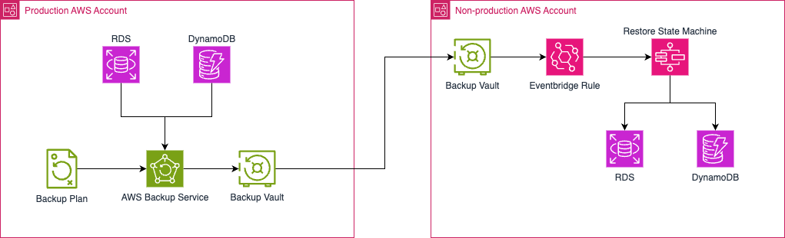

# AWS Backup Cross-Account Copy Solution

This repository contains Infrastructure as Code (IaC) for copying data from production to pre-prod account in an automated way using AWS Backup as a utility tool. The solution focuses on RDS Database as an example.

## Introduction

Most customers rely on automated testing in the pre-prod environment to improve the reliability and stability of the software being released. But for many applications, writing and running these tests effectively requires production or production like data.

Copying data from Prod to pre-prod is usually trickier than it sounds. This is because prod and pre-prod are usually different accounts without any network connectivity between them. And following the best practices, there is also stricter level of access controls put in place for Production account and its resources. Because of these reasons, it may not be possible to run a data sync tool between two environments.

So in this repo, we will present a way to setup automated copying of data from Production to pre-prod environment periodically using AWS Backup. For simplicity, we will focus on Amazon RDS Instances, although the solution could be extended to many other databases supported by the AWS Backup like Amazon DynamoDB, Amazon Aurora Clusters etc.

## Important Notice

**It is the customer's responsibility to ensure that there are no data confidentiality or compliance issues when replicating data from the production environment to the pre-production environment.**

The process described in this repository involves copying production data to a pre-production environment. This may include sensitive, regulated, or confidential information. It is crucial that you thoroughly review your data and ensure that you have the necessary permissions and approvals to replicate this data. Failure to do so could result in serious data breaches or non-compliance with applicable laws and regulations.

Before proceeding with the automated data replication, please consult with your legal, security, and compliance teams to ensure that you are not putting any sensitive data at risk. The authors of this repository cannot be held responsible for any data confidentiality or compliance issues that may arise from the use of this solution.

We strongly recommend that you carefully evaluate the data you plan to replicate and implement appropriate safeguards, such as data masking or anonymization, before moving production data to a pre-production environment.


## Architecture


### Workflow

The solution implements the following workflow for automated cross-account backup and restore:

1. **Production Account Setup**
   - Creates a Backup Vault to store backups
   - Configures a Backup Plan with:
     - Configurable backup schedule (for example: Sundays at 1am)
     - Selection of RDS DBs using resource tags
     - Cross-account copy configuration to pre-production account

2. **Backup Process**
   - AWS Backup creates snapshots of selected RDS instances (based on tags)
   - Backup copies (Recovery Points) are automatically transferred to pre-production account's Backup Vault

3. **Restore Automation in pre-prod account**
   - Upon successful backup copy, Amazon EventBridge receives an event
   - EventBridge triggers a Step Functions state machine that:
     - Initiates the restore process in pre-production environment
     - Monitors restore completion
     - Notifies the result to a SNS topic

## Prerequisites

- Terraform version >= 1.10.0 is installed.
- Multiple AWS accounts (production and pre-production environments) are setup and present in same AWS Org.
- Cross-account backup is enabled in the AWS Org. If not enabled, follow the [documentation](https://docs.aws.amazon.com/aws-backup/latest/devguide/create-cross-account-backup.html#prereq-cab) to enable it.

## Repository Structure

```
aws-backup-blogpost/
├── README.md
├── prod/
│ ├── variables.tf
│ └── ... (other terraform files)
├── pre-prod/
│ ├── variables.tf
│ └── ... (other terraform files)
```

## Usage

### Installation of resources in production account
1. Clone this repository

2. Navigate to the prod directory

3. Configure your variables:

```hcl
   terraform.tfvars:
   prod_backup_vault_name = "example-Backup-Vault-Prod"
   pre_prod_backup_vault_name = "example-Backup-Vault-PreProd"
   backup_frequency = "custom-schedule"
   backup_custom_schedule = "cron(55 15 ? * WED *)"
   pre_prod_account_id = "109876543210"
   pre_prod_region = "eu-west-1"
```

4. Assume the credentials by setting the below variables for the Production AWS account.

```bash
AWS_ACCESS_KEY_ID=xxxxxxxxxxxxxxx
AWS_SESSION_TOKEN=AWS_ACCESS_KEY_ID=xxxxxxxxxxxxxxx
AWS_SECRET_ACCESS_KEY=xxxxxxxxxxxxxxx
```

5. Initialize Terraform:

```bash
terraform init
```

6. Apply the configuration:
```bash
terraform plan
terraform apply
```

### Installation of resources in pre-production account

1. Navigate to the pre-prod directory

2. Configure your variables:

```hcl
   terraform.tfvars:
   pre_prod_backup_vault_name = "example-Backup-Vault-PreProd"
   prod_account_id            = "012345678910"
   rds_db_subnets = ["subnet-xxxxx", "subnet-xxxxx", "subnet-xxxxxx"]
```

4. Assume the credentials by setting the below variables for the Pre-production AWS account.

```bash
AWS_ACCESS_KEY_ID=xxxxxxxxxxxxxxx
AWS_SESSION_TOKEN=AWS_ACCESS_KEY_ID=xxxxxxxxxxxxxxx
AWS_SECRET_ACCESS_KEY=xxxxxxxxxxxxxxx
```

5. Initialize Terraform:

```bash
terraform init
```

6. Apply the configuration:
```bash
terraform plan
terraform apply
```

## Testing

After all the resources are deployed, wait for the schedule that you specified for backup in prod account.
Once the scheduled time is reached, AWS Backup takes a snapshot of RDS database (which has the tag `CopyToPreProd=true`)
and copies it to pre-prod account's AWS Backup Vault. Once the snapshot (called recovery point) is available in
pre-prod account, the step function initiates the restore of the database.


## Cleanup

After testing the solution, you can destroy all resources created by the Terraform. Make sure to assume the correct credentials for Prod and Pre-prod AWS accounts before destroying.

1. Navigate to pre-prod directory and run terraform destroy
```bash
cd pre-prod
terraform destroy
```

2. Navigate to prod directory and run terraform destroy
```bash
cd prod
terraform destroy
```

You can also delete the RDS database that the step function has created from the prod backup snapshot.

## License

This library is licensed under the Apache License. See the [LICENSE](LICENSE.txt) for more information.

## Contributing

See [CONTRIBUTING](CONTRIBUTING.md) for more information.
